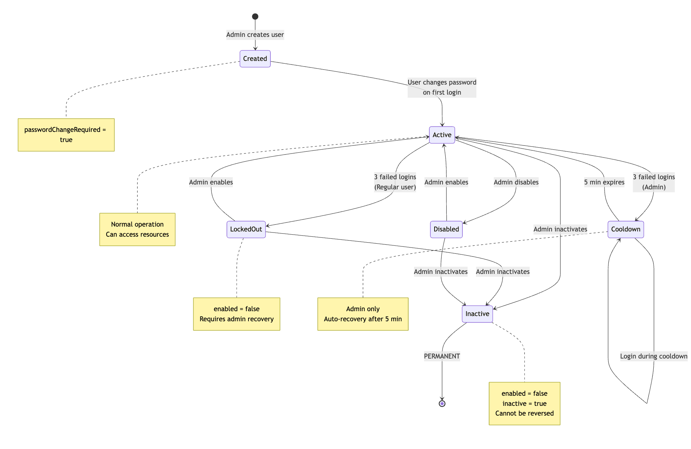
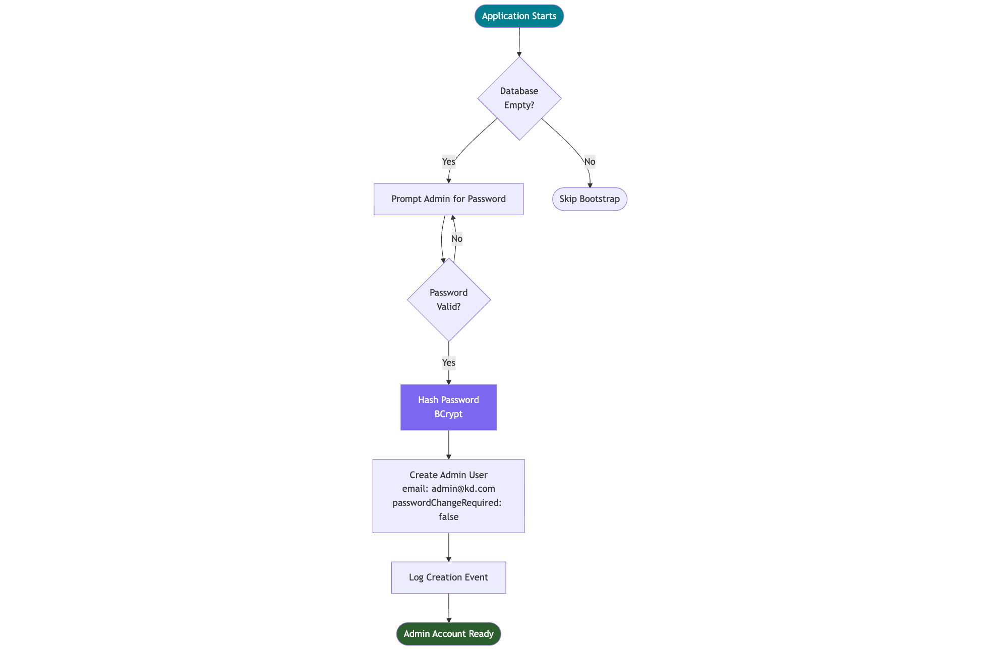
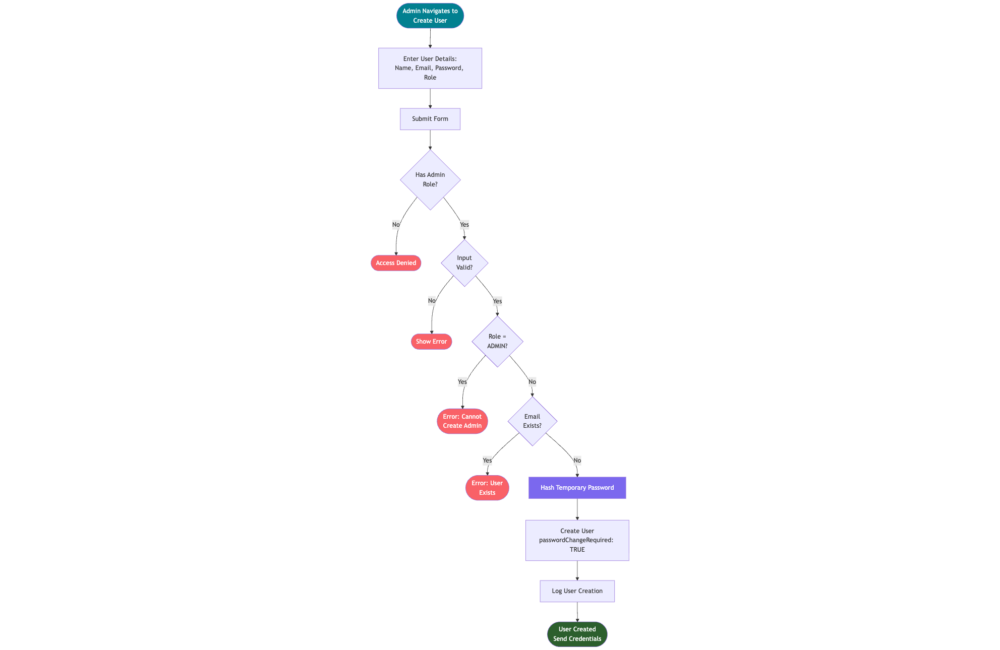
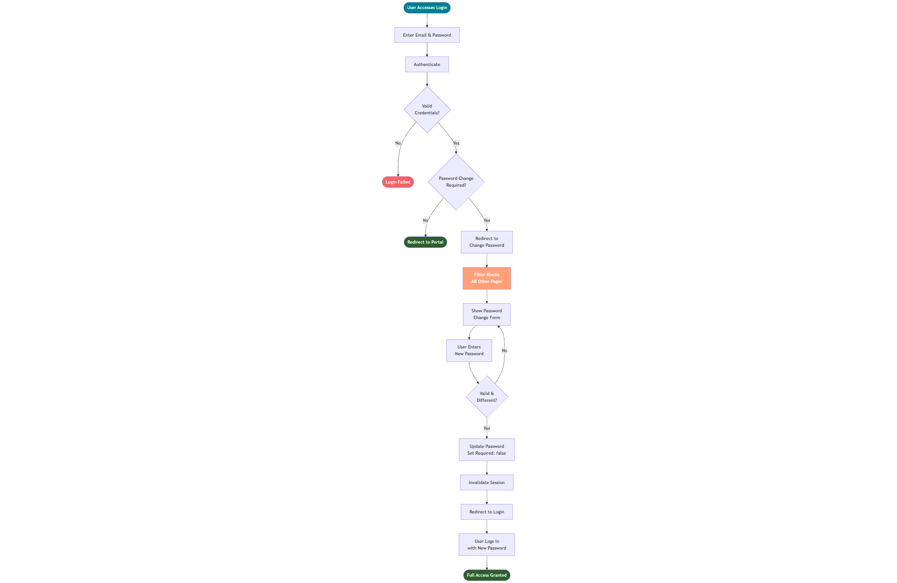
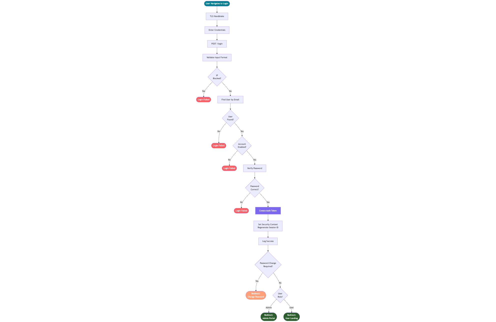
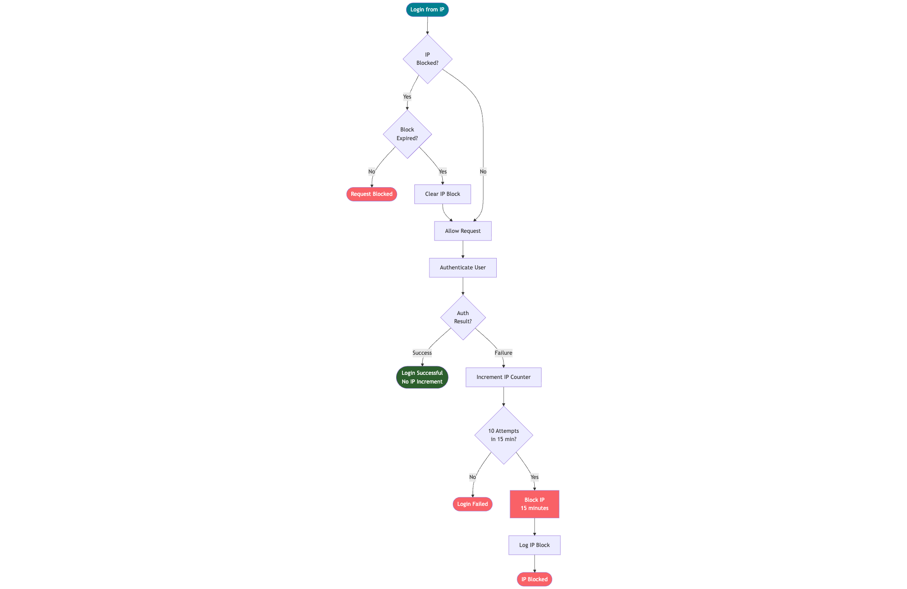
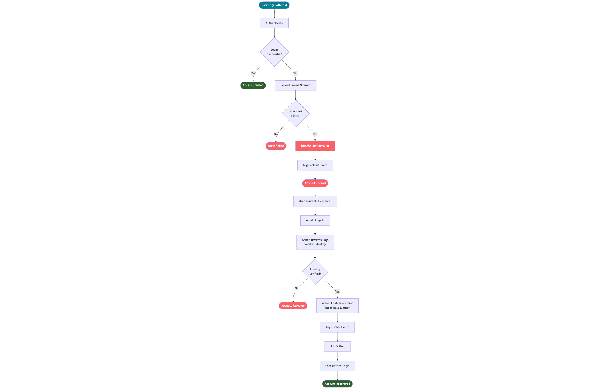
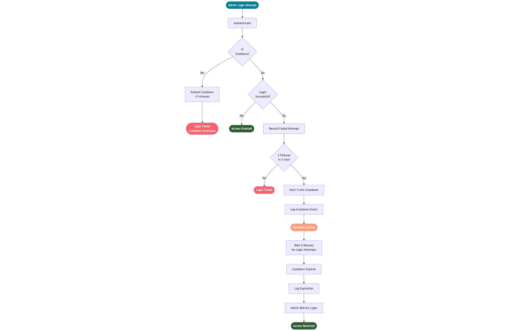

## 1. Scenario & Operating Assumptions

This system represents an **internal organisational portal login**.

Key assumptions that influenced design decisions:

- Users are **pre-authorised**.
- Accounts are created by administrators.
- There is **no public self-registration**.
- Identity proofing occurs outside this system.
- Infrastructure such as SMS/email gateways for MFA are not available within the time and cost constraints of this challenge.

Because of these constraints, security focus was placed on:

- Preventing abuse of valid accounts  
- Protecting administrative capability  
- Limiting blast radius  
- Making attacks visible  
- Enforcing strong authentication hygiene  

---
## 2. Core Design Philosophy
In an internal portal context, users don't self-register. Instead, accounts are provisioned by administrators (mimicking Active Directory/LDAP), given temporary credentials, and required to set their own secure password on first login. This matches how real organizations operate: IT creates accounts with default passwords, users are forced to change them immediately, and lifecycle management happens through admin intervention.

**Key Security Implementations:**
- Pre-authorized account model (admin-provisioned users, no self-registration)
- Mandatory password change on first login (enforced via servlet filter, see § 4.3)
- Multi-layer rate limiting (IP-based + user-based)
- Differentiated protection for admin vs. regular users (see § 4.7 for rationale)
- Secure session management with industry-standard cookie flags (see § 3, Layer 5)
- Comprehensive security headers (CSP, HSTS, X-Frame-Options)
- TLS 1.2/1.3 enforcement with strong cipher suites
- Dedicated security audit logging with daily rotation for SIEM integration (see § 3, Layer 7)
- Generic error messages to prevent information disclosure
- Account lifecycle management (enable/disable/inactivate)
- Fixed domain validation (email must be @kd.com for internal portal)

### Complete Lifecycle Overview

Comprehensive view of state transitions and recovery paths.



---

## 3. Defense in Depth

Authentication risk is not controlled by a single mechanism.
Instead, multiple independent safeguards operate together so that
failure or bypass of one layer does not expose the system.

The design intentionally distributes trust decisions across transport,
network behaviour, identity state, application logic, and session handling.

---

### Layer 1 – Transport Trust

Before credentials are evaluated, the communication channel must be protected.

#### Security Measures
- TLS enforced
- Legacy protocol versions disabled
- Strong cipher suites selected
- HSTS prevents downgrade and stripping attacks
- Development certificate automatically provisioned

If transport integrity fails, every higher control becomes meaningless.
This layer ensures credentials are never exposed in transit.

```properties
# Enforce modern TLS only
server.ssl.enabled-protocols=TLSv1.2,TLSv1.3

# Explicit cipher control
server.ssl.ciphers=TLS_AES_256_GCM_SHA384,\
TLS_AES_128_GCM_SHA256,\
TLS_ECDHE_RSA_WITH_AES_256_GCM_SHA384,\
TLS_ECDHE_RSA_WITH_AES_128_GCM_SHA256
```

---

### Layer 2 – Network Behaviour

Even valid-looking requests can be malicious if behaviour is abnormal.

#### Security Measures
- IP-based rate limiting with temporary blocks (see § 4.5 for rationale)
- Automatic expiry prevents operational impact in shared network environments
- Authentication attempts tied to source address

The goal is to slow automation without causing unnecessary
availability impact in shared enterprise network environments.

**Relevant Implementation**
- `service/LoginRateLimiter.java`
- `service/AuthService.java`

---

### Layer 3 – Identity Protection

The system evaluates whether the account itself is in a trustworthy state.

#### Security Measures
- Lockout after repeated failure
- Administrative cooldown model (see § 4.7)
- Mandatory password change flags
- Explicit lifecycle states
- Manual recovery pathways

Trust in identity is dynamic.
The system adapts based on behaviour and history,
not only credentials.

**Relevant Implementation**
- `service/AuthService.java`
- `service/PasswordChangeRequiredFilter.java`
- `repository/UserRepository.java`
- `model/User.java`

---

### Layer 4 – Application Enforcement

Input handling and responses must not help an attacker.

#### Security Measures
- Strict validation rules
- Password policy enforcement server-side
- Uniform error messages prevent user enumeration
- CSRF protection on state changes
- Password reuse prevention

Attackers should gain as little information as possible from the interface.
```java
private static final String EMAIL_REGEX = "^[A-Za-z0-9+_.-]+@kd\\.com$";

private static final String PASSWORD_REGEX =
  "^(?=.*[a-z])(?=.*[A-Z])(?=.*\\d)(?=.*[!@#$%^&*()_+=-])[A-Za-z\\d!@#$%^&*()_+=-]{8,64}$";
```
---

### Layer 5 – Session Integrity

Authentication success does not end risk.

#### Security Measures
- Session ID regeneration on login
- Secure cookie attributes
- Timeout on inactivity
- Proper invalidation on logout or password change

These measures prevent fixation, replay, and session theft
from undermining otherwise strong authentication.

```properties
server.servlet.session.timeout=15m
server.servlet.session.cookie.http-only=true
server.servlet.session.cookie.secure=true
server.servlet.session.cookie.same-site=strict
```
```java
.logout(logout -> logout
    .invalidateHttpSession(true)
    .deleteCookies("JSESSIONID")
)
```

---

### Layer 6 – Browser Containment

Client execution paths are restricted to reduce injection opportunities.

#### Security Measures
- Strict Content Security Policy
- Frame restrictions
- Controlled resource origins

By minimising what the browser is allowed to execute,
entire classes of XSS-style attacks become significantly harder.

**CSP Directives:**
- `default-src 'self'` - Only load resources from same origin
- `script-src 'self'` - Block inline scripts and external JavaScript
- `style-src 'self'` - Block inline styles and external CSS
- `img-src 'self'` - Only images from same origin
- `frame-ancestors 'self'` - Prevent clickjacking (same as X-Frame-Options)


```java
.headers(headers -> headers
    .contentSecurityPolicy(csp -> csp
        .policyDirectives(
            "default-src 'self'; script-src 'self'; style-src 'self'; img-src 'self'; frame-ancestors 'self';"
        )
    )
)
```

---

### Layer 7 – Observability & Accountability

Security must be measurable.

#### Security Measures
- Dedicated security log
- Structured event recording
- Separation from application logs
- Time-based rotation

Well-structured logs allow rapid integration with monitoring,
alerting, and forensic workflows.

Visibility turns defensive controls into actionable intelligence.

**Relevant Implementation**
- `logback-spring.xml`

```java
private static final Logger SECURITY_LOG =
        LoggerFactory.getLogger("SECURITY_AUDIT");
```

---
---

## 4. User & Operational Journeys

Beyond static controls, security must be understood in motion.

The following journeys illustrate how authentication, enforcement,
recovery, and administration behave in realistic scenarios.

These flows demonstrate how defensive mechanisms interact while
preserving operational continuity.

---

### 4.1 Administrative Bootstrap

Initial trusted entry into the system.


#### Security Features
- Password masking on console input
- Confirmation required
- Complexity validation

**Design Note**

The bootstrap administrator is a break-glass identity.
It exists to provision real administrators and should not be used for daily operations.

### 4.2 User Creation & Provisioning

How new identities enter the system under administrative control.


#### Security Features
- Admin authentication required
- Email domain restriction
- Server-side password validation
- Users flagged for mandatory password change
- Role assignment restricted


**Real-World Parallel**

HR submits onboarding → IT provisions account → temporary credential → forced rotation.

---

### 4.3 First Login Experience

Mandatory hygiene enforcement for newly created users.



#### Security Features
- Session allowed but restricted
- Redirect to password change
- Other routes blocked

**Security Implementation (PasswordChangeRequiredFilter):**
```java
// Filter checks EVERY request
if (user.isPasswordChangeRequired()) {
    // Only these paths allowed:
    // - /change-password
    // - /logout  
    // - /login
    // - /css/** (styling)
    
    // Everything else → Redirect to /change-password
}
```
**Design Note**

This prevents temporary or intercepted credentials from being used
to access the system beyond initial setup.

---

### 4.4 Standard Login Flow

Normal authentication path including layered protections.



#### Security Features
- **Uniform failure response**: All authentication failures return "Invalid credentials" (prevents username enumeration, see § 5)
- Parallel tracking of IP reputation and account abuse
- BCrypt password verification
- Session ID rotation after authentication (prevents fixation, see § 3, Layer 5)
- Post-authentication policy checks (e.g., forced password change)
- Successful login resets abuse counters
- Security events logged for traceability

**Design Note**

The goal is not merely to verify a password.

The goal is to decide whether this request should be trusted right now.

Even correct credentials are evaluated in context:

- Has this IP been abusive?
- Is the account in a safe state?
- Is additional hygiene required?
- Are we protecting an operational role?

By layering checks, the system avoids treating authentication as binary.
Access is granted only when identity, behaviour, and lifecycle expectations align.


---

### 4.5 IP Rate Limiting Scenario

This flow activates when repeated login attempts originate from the same source.
The intention is to slow automated abuse without permanently harming availability.



#### Security Features
- Login tracking per IP address
- Threshold-based temporary block
- Automatic expiry of penalties 
- Counters cleared after timeout
- Security logging for visibility

**Design Note**

Rate limiting creates friction for attackers, not outages for users.

Permanent lockouts based purely on network origin are dangerous in corporate 
environments where users share NAT, VPN exits, or proxy infrastructure.

The block is temporary and self-healing. IP reputation becomes part of the 
overall trust signal without causing availability issues.

---

### 4.6 Standard User Lockout

This scenario represents sustained or suspicious authentication failure
associated with a specific identity.



#### Security Features
- Account transitions to a disabled state
- Authentication attempts are rejected even with correct credentials
- Administrative intervention required for recovery
- Status changes are recorded for audit and traceability

**Design Note**

At this stage the system assumes elevated risk.

While the root cause may simply be user error, it may also indicate credential abuse.
Automatically restoring access would favour an attacker who can simply wait out the restriction.

For this reason, recovery requires an administrator. This allows identity to be validated 
through organizational processes such as internal communication or managerial confirmation.

For the distinction between user lockout and admin cooldown, see § 4.7.

---

### 4.7 Administrative Cooldown Protection

This scenario activates when repeated failures occur against a privileged operator.



#### Security Features
- Temporary restriction on authentication attempts
- Automatic recovery after cooldown window
- Additional attempts extend the restriction
- Events logged for visibility

**Design Note**

Administrative accounts are different from standard users.

If a normal user is unavailable, the organization can continue operating.
If administrators are unavailable, recovery, onboarding, and incident response may halt.

Permanently disabling administrators based solely on authentication failures 
introduces operational risk. An attacker could intentionally trigger lockouts 
to deny service.

Instead, the system applies a cooling-off period. This slows brute force 
while ensuring administrators regain access without requiring intervention 
from another operator.

Security is preserved, but availability is not sacrificed.

---

## 5. Threat Scenarios Considered

Security controls were selected based on realistic abuse patterns
commonly observed in enterprise authentication systems.

The goal is not only prevention, but also visibility and controlled recovery.

---

### Credential Stuffing / Password Guessing

**Risk**

An attacker repeatedly attempts different passwords across accounts,
hoping for credential reuse or weak combinations.

**Mitigation**

- IP-based rate limiting slows automation  
- Repeated failures transition accounts into protective states  
- Successful authentication resets counters  
- Password policy reduces guessability  

**Residual Risk**

Distributed infrastructure can weaken the effectiveness of
per-IP protections.

In a real deployment, surrounding layers such as VPN gateways,
intrusion detection systems, and SIEM-driven monitoring would
identify abnormal authentication volumes or geographic anomalies.

The application produces structured security events specifically
to support this integration.

---

### Username Enumeration

**Risk**

An attacker attempts to determine which identities exist,
reducing the search space for later attacks.

**Mitigation**

- Uniform authentication responses  
- No distinction between "user not found" and "wrong password"

**Residual Risk**

Timing differences may still provide minor signals.
Further response normalisation or artificial delay could be introduced if required.

---

### Administrator Lockout as Denial of Service

**Risk**

An attacker intentionally triggers thresholds to disable privileged staff,
impacting business continuity.

**Mitigation**

- Administrators enter temporary cooldown instead of permanent disable (see § 4.7)
- Automatic recovery ensures operational availability  

**Residual Risk**

High-volume sustained abuse may still slow access.
External monitoring and SOC awareness become important at this stage.

---

### Bypass of Mandatory Password Change

**Risk**

A user attempts to access protected resources before completing
initial hygiene requirements.

**Mitigation**

- Post-authentication filter restricts available paths (see § 4.3)
- Only password change and logout are permitted

**Residual Risk**

Minimal, assuming correct policy configuration.

---

### CSRF Against Sensitive Actions

**Risk**

A victim's authenticated browser is manipulated into performing
unintended state changes.

**Mitigation**

- CSRF protection enabled  
- Valid tokens required for submission  

**Residual Risk**

If the user's session itself is compromised,
this layer cannot provide protection.

---

### Session Fixation / Hijacking

**Risk**

An attacker reuses or predicts a valid session identifier.

**Mitigation**

- Session ID regeneration after login (see § 3, Layer 5)
- Secure cookie attributes  
- Explicit invalidation on logout and password change  

**Residual Risk**

Endpoint or browser compromise remains outside application control.

---

## 6. Operational Detection & Response Context

While the application provides preventative mechanisms,
enterprise environments typically surround authentication services
with additional monitoring capabilities.

Examples include:

- VPN access controls  
- IDS / IPS platforms  
- Centralized SIEM correlation  
- Behavioral analytics  

The structured logging format (§ 3, Layer 7) enables seamless integration
with these pipelines for alerting, trend analysis, and incident investigation.

**In summary: The application resists attacks; the organization detects and responds**.

---

## 7. Technology Choices & AI-Assisted Development

### 7.1 Why Spring Boot & Java?

**Professional Experience**

I chose Spring Boot 3.x with Java 17 because I have developed in Java professionally. 
This allowed me to focus on implementing security controls rather than learning 
a new framework within the limited timeframe.

**Technical Foundation**

- Generated initial project structure using [Spring Initializr](https://start.spring.io/)
- Spring Security provides mature authentication and authorization primitives
- Built-in support for session management, CSRF protection, and security headers
- JPA/Hibernate for clean data access layer
- Embedded Tomcat simplifies TLS configuration and deployment

### 7.2 AI Usage & Development Approach

**Tools Used**
- **Claude (Anthropic)** - Architecture guidance and code generation
- **GPT-4 (OpenAI)** - Code generation and pattern suggestions  
- **GitHub Copilot (VS Code)** - Inline code completion and comment generation

**How AI Was Used**

**Skeleton Code Generation**
- Used Claude and GPT-4 to generate base project files
- Created entity models, repository interfaces, and controller templates
- Generated initial configuration files (application.properties, logback-spring.xml)

**Development Assistance**
- Copilot helped with:
  - Auto-completing code as I typed
  - Generating JavaDoc comments
  - Suggesting Spring Security configuration patterns
  - Writing boilerplate (getters, setters, constructors)

**What I Implemented Manually**

The security nuances were my own decisions:
- Rate limiting logic
- Admin cooldown instead of lockout (DoS prevention)
- Password change enforcement on first login filter logic
- Generic error messages ("Invalid credentials" for all failures)
- Security audit logs
- etc...

---
